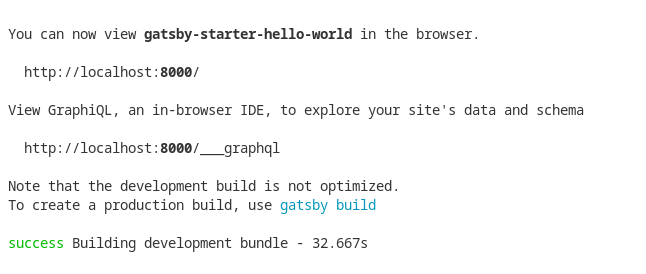

<p align="center">
  <a href="https://biblebeforebread.com">
    
  </a>
</p>
<h1 align="center">
  Bible Before Bread -  Read your bible before your breakfast!
</h1>

## 📜 About 📜
[BibleBeforeBread](https://biblebeforebread.com/) is a website to encourage a daily habit of reading God's word through featured verses and a variety of interactive features. This is a work in progress with the aim of creating unique web app features that will provide a fun way to interact with scripture and ultimately bring you closer to our Lord Jesus Christ ✝️.

**Want to get involved in this project? Contributions are welcome!**  
Read the [CONTRIBUTING](./CONTRIBUTING.md) rules and see the [ISSUES](../../issues) section for ways you can help out.

## ⚙️ Useful to know ⚙️

Website domain is [BibleBeforeBread.com](https://biblebeforebread.com/). 

Hosted on [Netlify](https://www.netlify.com/).

Built using [Gatsby](https://www.gatsbyjs.com/), a React-based framework.  

New to Gatsby? Follow the [Gatsby tutorials](https://www.gatsbyjs.com/docs/tutorial/) to learn about how Gatsby works.

This site uses the [gatsby-starter-hello-world](https://github.com/gatsbyjs/gatsby-starter-hello-world) repo on GitHub as the base. You may read through that repo to understand how folders and files of this Gatsby site are structured.

## 💻 How to build, run and make changes 💻 

Fork and Clone repo to your PC.

Install [Gatsby CLI](https://www.gatsbyjs.com/docs/tutorial/part-0/#gatsby-cli).

In root directory of repo on your local PC run the following commands.

Install node modules
```shell
npm install
```

Run gatsby develop
```shell
gatsby develop
```

When build is successful you'll see:  


This will allow you to view the site on a web browser at `http://localhost:8000/`

Make your changes and test in your local environment. Then submit a PR to this repo.

### ❓ Got a question, something to discuss or just curious to learn more about this project? Check out the [DISCUSSION](../../discussions) section.
